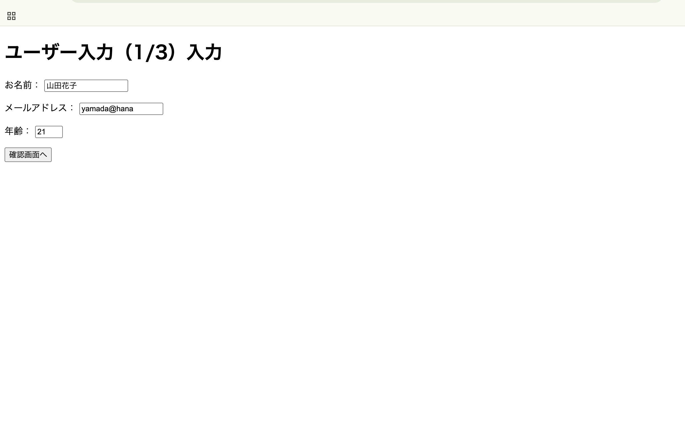

# php-form-practice

## 概要

COACHTECH 教材 Tutorial 7-4「フォームとデータ受け渡し ハンズオン演習」で作成した成果物です。
入力->確認->完了の3スッテで動作するユーザー登録フォームを作成しました。

## 使用技術

- PHP 8.x
- HTML5（フォーム要素）

## 学んだこと

- HTMLフォームからPHPに値を渡す仕組み（$_POST、$\_GET）
- 入力 → 確認 → 完了 の3画面遷移と、画面間のデータ受け渡し
- htmlspecialchars によるXSS対策の必要性

## 動作確認

- 入力画面で名前・メールアドレス・年齢を入力できる
- 確認画面で入力内容が正しく表示される
- 確認画面の戻るボタンで入力画面に戻れること
- 完了画面に名前とメールアドレスが表示される
- 完了画面のリンクから入力画面に戻れること

## 詰まったポイントと解決方法

画面間のデータ受け渡しで名前とemailの情報の不一致があり、エラーや入力確認欄、最後の完了画面の表示が思い通りではなかったので、書いたデータの情報を再度確認し、情報を修正した。

## 開発の工夫

- 確認画面でボタンの要素にonclick="history.back()"を書き、ユーザー内容の修正を行えるように戻る機能を付けたこと。
- 登録完了画面で最初の登録画面に戻れるようにhref="input.php"リンクを書いたこと。

## 動作確認のスクショ

